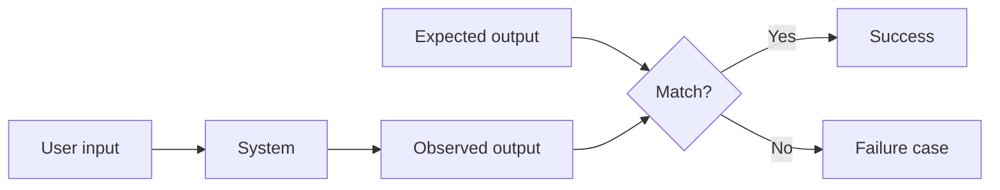
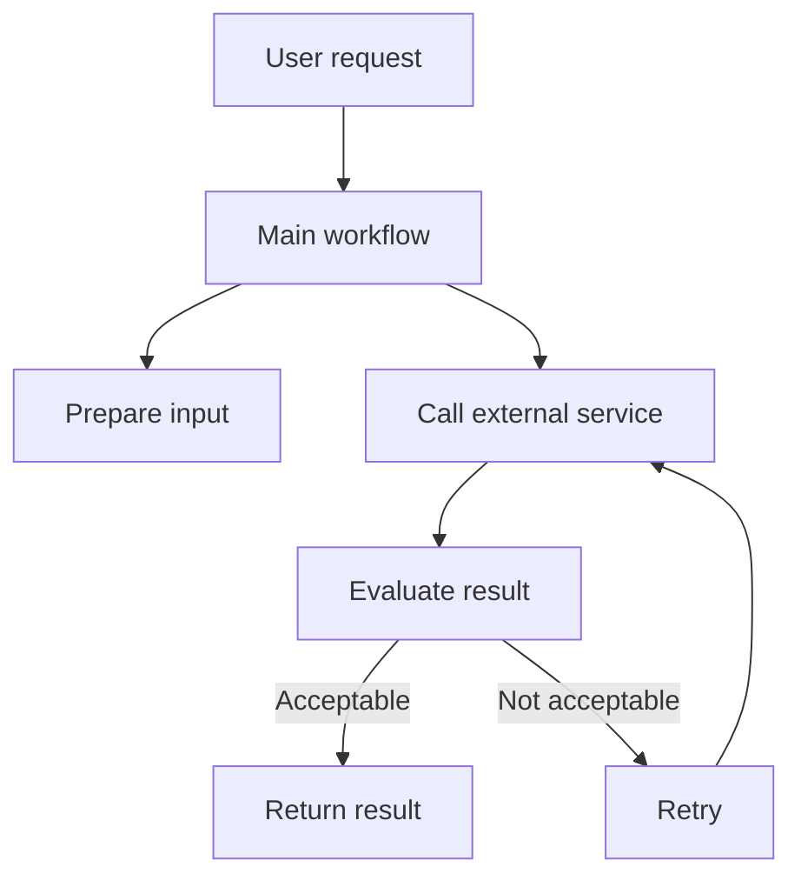
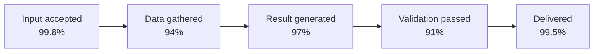
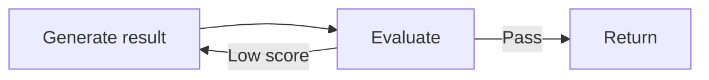
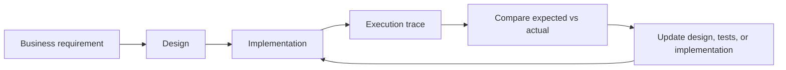

# Understanding Implementation Without Reading Code

## Core idea

Implementation can be understood as a system of:

1. **Intent** — what should happen
2. **Structure** — which components participate
3. **Execution** — what actually happened
4. **Evidence** — traces, metrics, logs, outputs
5. **Feedback** — how evidence changes the next design

Code is only one representation of the system. For non-engineers, the most useful representations are diagrams, execution traces, inputs/outputs, failure rates, timing, costs, and observed user outcomes.

---

## 1. Treat implementation as a black box first

A black box receives an input, performs hidden work, and produces an output.

Ask:

- What input entered the system?
- What output was expected?
- What output actually appeared?
- How often does the expected output occur?
- Under which conditions does it fail?
- What does failure look like to the user?

Do not begin with internal technical detail. Begin with observable behavior.

### Minimal model



---

## 2. Separate expected behavior from actual behavior

Most implementation problems are not simply “the system is broken.”

They are gaps between:

- what stakeholders expect
- what the system was designed to do
- what was implemented
- what happened during execution
- what users inferred the system could do

A system can improve while users become less satisfied because user expectations rise faster than system capability.

### Useful concept: expectation gap

```text
Expectation gap = perceived capability − actual reliable capability
```

The implementation goal is not only to increase capability. It is also to reduce ambiguity about limits and make failures diagnosable.

---

## 3. Understand implementation at three levels

### Level 1: Design view

Shows what is supposed to happen.

Useful artifacts:

- process flowchart
- sequence diagram
- component map
- data-flow diagram
- input/output contract
- decision table
- technical design summary

Questions:

- What are the major steps?
- Which component owns each step?
- What data moves between steps?
- Where are decisions made?
- What can stop or repeat the flow?
- What is the expected final result?

### Level 2: Structure view

Shows how the implemented parts are connected.

Useful artifacts:

- call stack
- dependency map
- module map
- API map
- state-transition diagram
- data schema

Questions:

- Which component calls which?
- Which parts depend on external services?
- Which steps are reusable?
- Which parts share the same data?
- Where could one change affect multiple areas?
- Are responsibilities duplicated or overlapping?

### Level 3: Execution view

Shows what happened in a real run.

Useful artifacts:

- trace
- waterfall
- timeline
- run report
- input/output snapshots
- retry history
- error path
- cost and latency breakdown

Questions:

- Which steps actually ran?
- In what order?
- How many times?
- How long did each take?
- Which step failed first?
- What was skipped?
- What repeated unexpectedly?
- Which external call consumed the most time or cost?

---

## 4. Use tracing as a readable execution story

A trace is a structured record of one execution.

It should answer:

- where execution started
- which steps were called
- parent-child relationships between steps
- input and output of important steps
- duration of each step
- errors
- retries
- external requests
- final result

### Trace mental model



A trace converts this abstract diagram into evidence from one actual run.

### What a non-engineer should inspect

- unusually long bars
- repeated steps
- missing expected steps
- retries
- branches taken
- first error, not only final error
- external calls
- large inputs or outputs
- unexpected sequence order

---

## 5. Distinguish metrics, logs, and traces

### Metrics

Aggregated numbers over time.

Examples:

- success rate
- error rate
- average duration
- 95th percentile duration
- cost per run
- retry rate
- percentage of users receiving an undesired result

Best for:

- detecting that a problem exists
- comparing periods
- tracking reliability
- measuring improvement

Weakness:

- usually does not explain one specific failure

### Logs

Individual text or structured events.

Examples:

- “payment validation failed”
- “agent selected page X”
- “API returned 429”
- “retry 2 started”

Best for:

- details about known events
- error messages
- operational history

Weakness:

- difficult to reconstruct the full workflow from scattered entries

### Traces

Connected records of the full path of one execution.

Best for:

- understanding sequence
- locating the first failure
- seeing retries and dependencies
- comparing expected and actual flow

Weakness:

- can become large, expensive, or unsafe if everything is stored without rules

---

## 6. Ask for wide event data

A narrow record stores only preselected facts.

Example:

```text
timestamp, error_count
```

A wide event stores many useful dimensions.

Example:

```text
run_id
user_type
workflow
step
input_type
output_type
region
model
duration
cost
retry_count
error
external_service
result_status
```

Wide data matters because the relevant failure condition is often unknown before the failure occurs.

A future investigation may reveal:

- failures happen only for one input type
- slow runs use one external provider
- retries correlate with large prompts
- one region receives stale data
- one workflow version causes most errors

### Non-engineer rule

Do not ask only, “What dashboard do we need?”

Also ask, “What facts must be captured now so we can answer unknown questions later?”

---

## 7. Measure subsystems, not only the whole product

A single success rate can hide where failure originates.

Example:

```text
Overall workflow success: 92%
```

This does not show whether the weak point is:

- data collection
- external API
- model generation
- validation
- file writing
- user delivery

Measure each major stage separately.



The total result is constrained by the weakest stage.

---

## 8. Find the first divergence

The final error is often a downstream symptom.

Example:

```text
Final result missing
```

Possible real sequence:

1. source page failed to load
2. extraction returned empty data
3. model generated a fallback answer
4. validator rejected the answer
5. output file was not written

The most useful question is:

> At which earliest step did actual execution diverge from the expected execution?

This prevents teams from fixing symptoms instead of causes.

---

## 9. Use inputs and outputs as contracts

For every important step, define:

- accepted input
- produced output
- required fields
- optional fields
- failure output
- timeout behavior
- retry behavior
- ownership

Example:

```yaml
step: validate_research_result
input:
  required:
    - source_url
    - extracted_facts
    - output_schema
output:
  success:
    - validation_status
    - missing_fields
    - unsupported_claims
  failure:
    - error_type
    - error_message
```

A non-engineer can review whether these contracts match business requirements without reading implementation code.

---

## 10. Understand retries and loops

Retries can improve reliability but also hide problems.

Inspect:

- maximum retry count
- reason for retry
- whether input changes between retries
- whether the same failing action is repeated
- stop condition
- fallback behavior
- added cost and time

### Dangerous loop pattern



Without a working attempt counter or stop condition, the system may repeat indefinitely.

A non-engineer does not need to inspect the loop code. They need trace evidence showing:

- attempt 1
- attempt 2
- attempt 3
- stop reason
- final result

---

## 11. Understand external dependencies

Many implementation failures occur outside the product’s own logic.

Common external dependencies:

- APIs
- databases
- websites
- payment providers
- authentication providers
- LLMs
- queues
- file storage
- third-party packages

For each dependency, ask:

- What does the system request?
- What response is expected?
- What happens when it is slow?
- What happens when it is unavailable?
- What happens when it returns malformed data?
- Is there a timeout?
- Is there a retry?
- Is there a fallback?
- Is failure visible to the user?
- Can the trace distinguish internal failure from provider failure?

---

## 12. Understand nondeterministic systems

Traditional software usually produces the same output for the same input.

LLM-based systems may produce different outputs because of:

- model sampling
- changing model versions
- changing retrieved context
- changing web content
- tool selection
- timing
- incomplete instructions
- ambiguous user input

Therefore, correctness cannot be judged only by “Did it run?”

It should be judged by:

- success criteria
- acceptable variance
- failure categories
- evaluation score
- reproducibility
- evidence used
- rate of acceptable outcomes

### Better question

Not:

> Does the agent work?

Use:

> For which input classes, under which conditions, at what success rate, cost, and latency does the agent produce an acceptable result?

---

## 13. Evaluate behavior, not only errors

A run may complete without a technical error and still be wrong.

Examples:

- skipped a required page
- returned incomplete data
- used unsupported facts
- chose the wrong tool
- repeated unnecessary work
- produced the wrong file structure
- met schema syntax but violated content requirements

Track outcome quality separately from technical health.

```text
Technical success: workflow completed
Business success: output satisfied the requirement
```

Both must be measured.

---

## 14. Use visualizations to reduce cognitive load

Good implementation views should make anomalies visible immediately.

Useful visual forms:

- waterfall for time spent
- flame graph for nested calls
- sequence diagram for interaction order
- flowchart for decisions
- state diagram for lifecycle
- dependency graph for coupling
- Sankey-style flow for volume movement
- table for input/output contracts
- heatmap for failure concentration

The goal is not decorative documentation. The goal is to let a reviewer recognize the system shape before reading details.

---

## 15. Create a closed implementation loop

The strongest implementation process connects design and execution.



This loop answers:

- Did execution follow the designed path?
- Which designed step did not occur?
- Which unexpected step occurred?
- Which assumption was wrong?
- Which requirement was ambiguous?
- Which evidence should be captured next time?

---

## 16. Use agents to summarize traces, not replace evidence

An AI agent can help interpret a large trace.

Good uses:

- identify the first divergence
- summarize the execution path
- rank likely causes
- locate expensive steps
- compare two runs
- identify missing expected calls
- generate a human-readable incident summary

But the underlying trace should remain available.

Required pattern:

```text
Evidence → agent interpretation → human review
```

Avoid:

```text
Agent interpretation without inspectable evidence
```

---

## 17. Capture rich data safely

More observability creates risks.

Potentially sensitive fields:

- authentication headers
- passwords
- tokens
- personal data
- environment variables
- payment details
- private prompts
- uploaded files
- internal URLs

Ask whether the system:

- redacts secrets
- excludes risky headers
- masks personal data
- controls access
- limits retention
- deduplicates large values
- samples high-volume traces
- records metadata instead of full content where appropriate

Observability should increase understanding without creating a new security problem.

---

## 18. Understand observability trade-offs

Capturing everything can increase:

- network usage
- storage
- CPU usage
- latency
- cost
- privacy risk
- investigation noise

A practical model:

### Always capture

- run ID
- step name
- parent step
- start/end time
- duration
- status
- error type
- retry count
- model/provider
- external dependency
- schema/version

### Capture selectively

- full inputs
- full outputs
- large files
- images
- prompts
- response bodies
- headers

### Never capture unredacted by default

- credentials
- secrets
- access tokens
- private keys
- sensitive personal data

---

## 19. Review implementation through questions

### System purpose

- What user problem does this implementation solve?
- What is the observable successful outcome?
- What is explicitly out of scope?

### Flow

- What are the major stages?
- Where does the process branch?
- Where can it retry, pause, or stop?
- Which steps are mandatory?

### Data

- What data enters?
- Where is it transformed?
- What data is persisted?
- What schema defines the output?
- Which source supports each result?

### Dependencies

- Which external systems are involved?
- Which dependency is slowest or least reliable?
- What fallback exists?

### Reliability

- What is the current success rate?
- What is the business-quality pass rate?
- What are the main failure categories?
- Which subsystem causes the most failures?

### Performance

- Which step consumes the most time?
- Which step consumes the most money?
- How many calls occur per run?
- How many retries occur?

### Observability

- Can one failed run be reconstructed?
- Can expected and actual execution be compared?
- Can the first divergence be found?
- Can an agent query traces?
- Are sensitive values redacted?

### Maintainability

- Which parts are tightly coupled?
- Which responsibilities overlap?
- Which change could break unrelated behavior?
- Are interfaces and data contracts explicit?

---

## 20. Minimum artifact set for non-engineer review

Request these artifacts for any significant implementation:

1. **One-page system summary**
2. **Process flowchart**
3. **Component and ownership map**
4. **Sequence diagram for the main use case**
5. **Input/output contracts**
6. **Example successful trace**
7. **Example failed trace**
8. **Metrics dashboard**
9. **Failure taxonomy**
10. **Dependency list**
11. **Security/redaction rules**
12. **Expected-vs-actual comparison report**

These artifacts provide enough context to understand how implementation behaves without reading code.

---

## 21. Practical implementation review template

```markdown
# Implementation Review

## Intended outcome
[What the user should receive]

## Main flow
1. [Step]
2. [Step]
3. [Step]

## Components
| Component | Responsibility | Input | Output | Owner |
|---|---|---|---|---|

## External dependencies
| Dependency | Purpose | Timeout | Retry | Fallback |
|---|---|---:|---:|---|

## Success criteria
- [Criterion]
- [Criterion]

## Failure categories
| Failure | User impact | Detection signal | First responsible stage |
|---|---|---|---|

## Execution evidence
- Example successful run:
- Example failed run:
- Trace location:
- Dashboard:

## Performance
| Stage | Calls | Duration | Cost | Retry rate |
|---|---:|---:|---:|---:|

## Expected vs actual
| Expected | Actual | Divergence | Required change |
|---|---|---|---|

## Open risks
- [Risk]
- [Risk]
```

---

## 22. Key concepts to retain

### Black box

Understand the system by inputs, outputs, and observed behavior before internal details.

### Observability

Ability to infer what happened inside the system from recorded evidence.

### Metric

Aggregated measurement showing whether a problem exists.

### Log

Recorded event showing a specific message or condition.

### Trace

Connected execution history showing what happened, in what order, and how long it took.

### Span

One timed step inside a trace.

### Call stack

The nested chain of actions that led to a result.

### Waterfall

Timeline visualization showing duration and nesting of steps.

### Wide event

One record containing many dimensions for future investigation.

### Contract

Explicit definition of what a component accepts and returns.

### Invariant

A rule that must always remain true.

### Dependency

External or internal component required for a step to work.

### Retry

Repeated attempt after failure.

### Fallback

Alternative behavior when the preferred path fails.

### Nondeterminism

Same input may not always produce identical output.

### Expectation gap

Difference between what users believe the system can do and what it reliably does.

### First divergence

Earliest point where actual execution stops matching expected execution.

### Closed loop

Design, execution evidence, comparison, and improvement continuously inform each other.

---

## Final mental model

Do not ask only:

> What code was written?

Ask:

> What behavior was intended, what path actually executed, what evidence proves it, where did reality diverge from expectation, and how will that evidence improve the next version?
